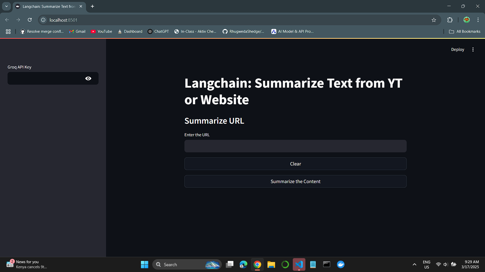
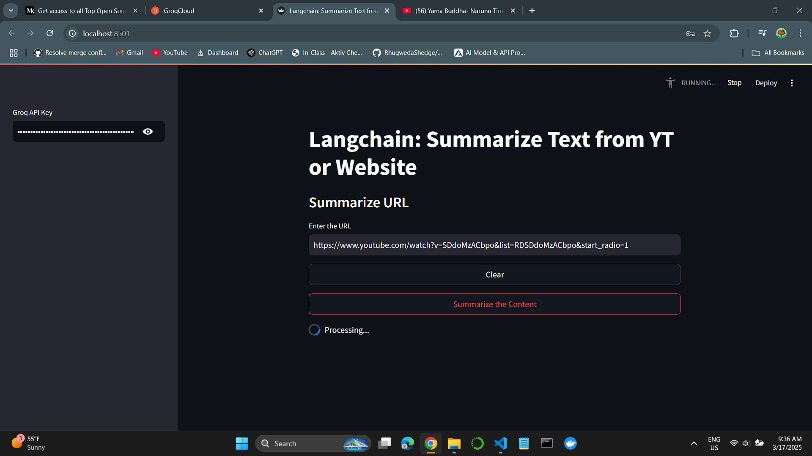
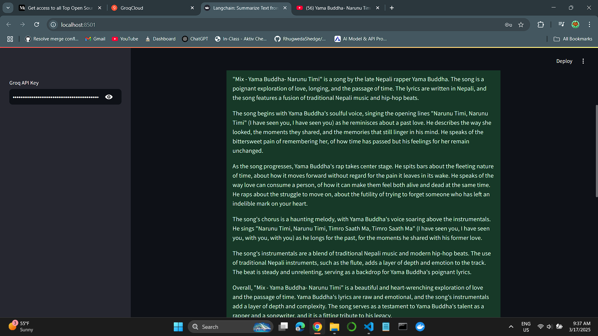
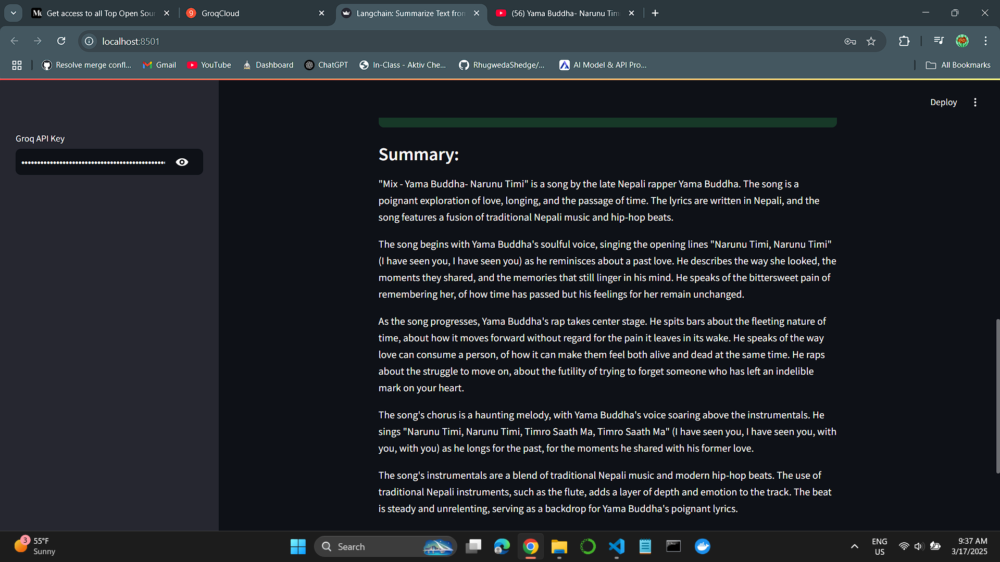

# 📌 TEXT SUMMARIZER

🚀 Overview

This project is a Streamlit-based application that utilizes LangChain and Groq AI models to summarize content from YouTube videos and websites. It extracts relevant information and generates concise summaries, helping users quickly grasp the key points.

## 🛠 Features

-✅ Summarizes content from YouTube videos using yt-dlp
-✅ Extracts and processes text from websites
-✅ Uses LangChain and Groq AI models for intelligent text summarization
-✅ User-friendly Streamlit interface

## 📷 Demo / Screenshots

Here are some screenshots showcasing the application's functionality:






## 🏗 Tech Stack

Programming Language: Python
Frameworks: LangChain, Streamlit
Libraries: yt-dlp, validators
AI Model: Groq (mixtral-8x7b-32768)

## 🎬 Installation & Usage
Follow these steps to set up and run the project:

### Prerequisites
Ensure you have Python and pip installed.

## Installation
Clone the repository and install dependencies:
```
git clone https://github.com/yourusername/web-summarizer.git
cd langchain-summarizer
pip install -r requirements.txt
```
Note: I have alot of dependencies in my requirements.txt for the use on the projects that I have been doing. You can only install the required dependencies for this project.

📂 Folder Structure
```
text-summarizer/
│-- app.py                         # Main Streamlit application
│-- requirements.txt               # Dependencies
│-- README.md                      # Project documentation
│-- static/                        # Images and assets for README
│-- .gitignore                     # for ignoring .env and myvenv
│-- .github/ISSUE-TEMPLATE.md      #for open contributions 
```

📜 License

This project is licensed under the MIT License.
